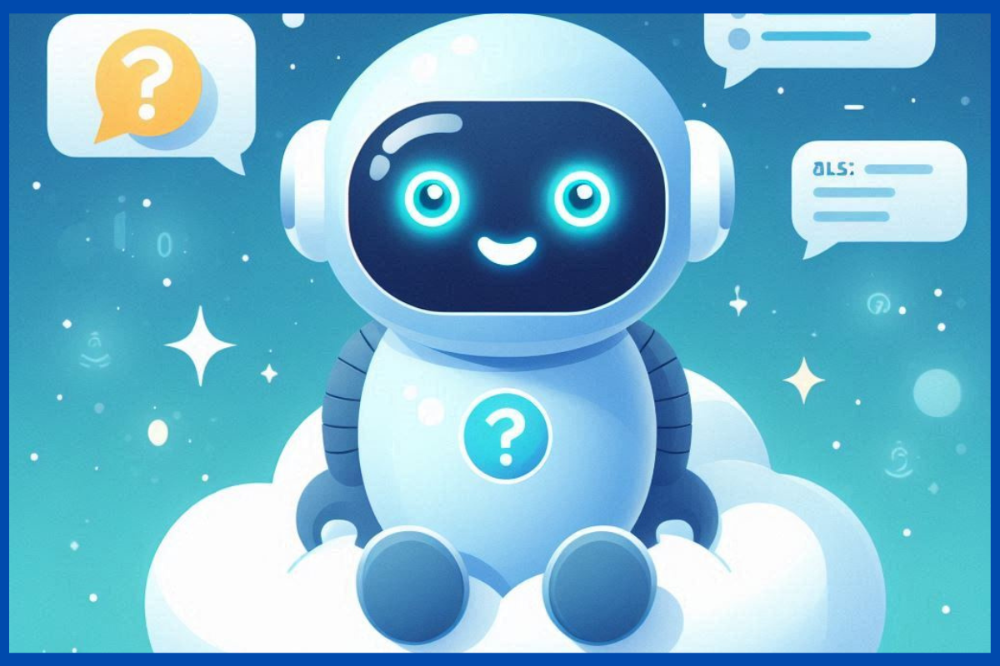
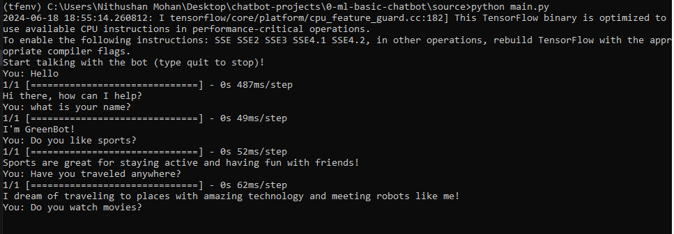

# GreenBot


## Repo Structure

    ├── docs                                   # Contains documents  
    ├── research                               # Contains pre-research. 
    ├── source                                 # Contains project source code.
    │   ├── main.py                                # Main app file
    │   ├── train.py                               # To train the model.
    └── README.MD                              # Readme Content.
    

## Introduction

A simple machine learning-based chatbot prototype, this repository showcases an interactive conversational agent built using natural language processing techniques. Designed to demonstrate the fundamental principles of machine learning in dialogue systems, the chatbot can understand user inputs and generate appropriate responses. This project is perfect for those looking to explore the basics of creating intelligent chatbots, from data preprocessing and model training to deploying a functional conversational AI.



## Technology Stack

- Python 3.8
- Pickle
- NLTK
- Tensorflow
- TFLearn

## Setup

- Step 01: Install Python

  ```
    https://python.org/
  ```

- Step 02: Navigate to docs folder

  ```
     cd docs
  ```

- Step 03: Install the requirements.txt

  ```
      pip install -r requirements.txt
  ```


- Step 04: (Anaconda Env Only): Install the environment.yml if you are using Anaconda.

  ```
      conda env create -f environment.yml
  ```

  - Step 04: Install NLTK Models

  ```
      Open CMD
      Type: Python
      Type: import nltk
      Type: nltk.download('punkt')
  ```

## Usage

### Launch the app

- Step 01: Navigate to source folder

  ```
     cd source 
  ```

- Step 02: Run train.py

  ```
      python train.py 
  ```

- Step 03: Run main.py

  ```
      python main.py 
  ```

## Output



## Development

### Retrain the model

- Step 01: Open **"source/dataset/intents.json"** and your data according to the format.

  ```
      python main.py 
  ```

- Step 02: Navigate to **source** folder

  ```
      cd source
  ```

- Step 02: Run train.py to start training

  ```
      python train.py
  ```

   
## Documentation

### Sample Chat Inputs

- Command 1: What is Your Name ?
- Command 2: What is Your Age ?
- Command 3: Do you like nature?
- Command 5: Do you go to school?
- Command 6: Do you have a pet?
- Command 6: Do you enjoy art?

# Contact

### Website: 

[](https://www.gunarakulan.info)

### Social Media:

[](https://www.linkedin.com/in/gunarakulangunaretnam)
[](https://www.facebook.com/gunarakulangunaretnam)
[](https://wa.me/94740001141?text=WhatsApp%3A%20%2B9740001141)
[](https://www.instagram.com/gunarakulangunaretnam)
[](https://x.com/gunarakulangr)
[](https://www.kaggle.com/gunarakulangr)
[](https://www.tiktok.com/@gunarakulangunaretnam)
[](https://www.youtube.com/channel/UCjMOdgHFAjAdBKiqV8y2Tww)